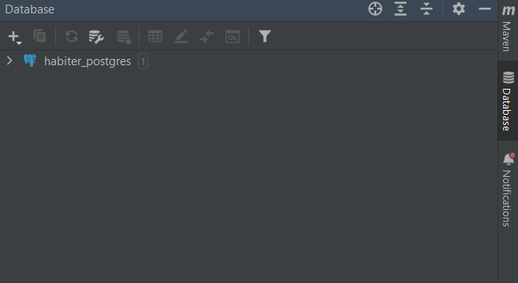
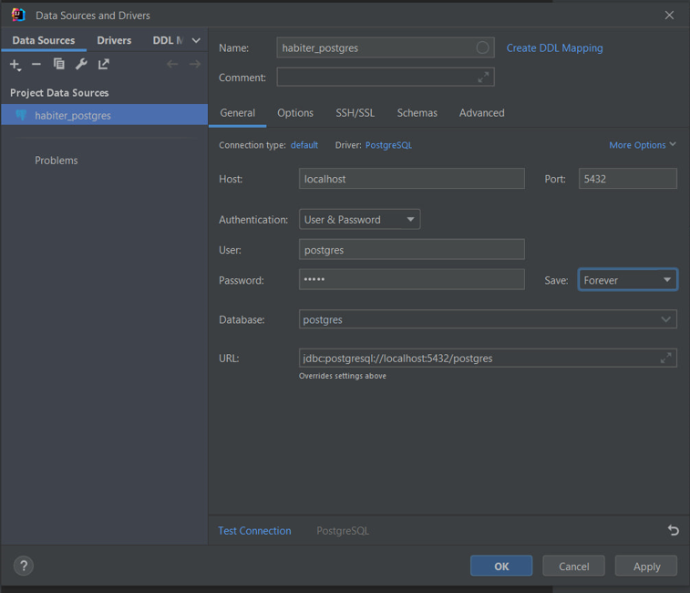

# Habiter project backend repository

The Habiter is a website for tracking your habits. Its main reason is to organize your life and acquire new habits.
This repository is backend development.

## Setting up Docker

### Step 1: Download the Linux kernel update package
Download the latest package:

[WSL2 Linux kernel update package for x64 machines](https://wslstorestorage.blob.core.windows.net/wslblob/wsl_update_x64.msi)

Run the update package downloaded in the previous step. (Double-click to run - you will be prompted for elevated permissions, select ‘yes’ to approve this installation.)

### Step 2: Download the latest version of Docker

[Docker 4.16.3](https://desktop.docker.com/win/main/amd64/Docker%20Desktop%20Installer.exe?utm_source=docker&utm_medium=webreferral&utm_campaign=docs-driven-download-win-amd64)

### Step 3: Basic installation

Accept the term of agreements and start the Docker Desktop

### Step 4: Introduction to Docker

As your program starts just skip the tutorial

### Step 5: cmd 

Run you cmd, and write the following code:

`docker run —name habiter_postgres -v ":C:\Users\kmoon\Desktop\Habiter Project\postgres\data:/var/lib/postgresql/data/" -p 5432:5432 -e POSTGRES_PASSWORD=admin postgres:15`

### Important
`C:\Users\kmoon\Desktop\Habiter Project\postgres\data` -> this is the location where the postgreSql's files should be saved.
Change the above path to your local folder

### Step 6: IntelliJ Idea database set up

On the right side of the IntelliJ you will see the database bar
Open it and press on the plus button

Set up this page as showed in the picture
